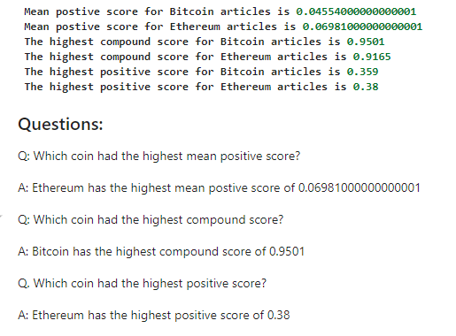

# Natural Language Processing - Crypto Sentiment
Bitcoin and Ethereum Sentiment analysis using Natural Language Processing (NLP)
In order to gauge the sentiment in the news articles about Bitcoin and Ethereum cryptocurrencies, Natural language processing techniques were used. To get the news articles NewsAPI was used and clean the text and analyze it Natural Language Tool Kit (NLTK) was used.

- In order to fetch the news articles NewsAPI Key was setup from .env file. Then using the newsapi.get_everything function was invoked to fetch the articles.

- Next a dataframe of sentiment score was created after getting the score using SentimentIntensityAnalyzer from nltk.sentiment.vader

- Function .describe() used to view the important statistics related to the Sentiment Score

- This information was used to compare the sentiment score between Bitcoin and Ethereum.

### Tokenization

To further analysis different fuctions/libraries were used
- Regular Expression was used take out puctuations

- Lemmatizer was used to take out the words that are common in english that do not add value to the sentiment in the article.

- Then all the words were converted to lower case as upper case does not add anything to the context.

- Bigrams were counted using ngrams and Counter libraries and top 10 bigrams were reviewed.

Bitcoin Top 10 words

('char', 96),
 ('bitcoin', 29),
 ('new', 24),
 ('cryptocurrency', 23),
 ('ha', 18),
 ('tuesday', 15),
 ('crypto', 15), 
 ('cook', 13),
 ('market', 13),
 ('world', 12)

 Ethereum Top 10 words

 ('char', 99),
 ('cryptocurrency', 29),
 ('ethereum', 26),
 ('ha', 26),
 ('bitcoin', 25),
 ('new', 16),
 ('market', 12),
 ('record', 12),
 ('high', 12),
 ('crypto', 12)

### Word Clouds

Generated the Bitcoin and Ethereum using word cloud

### Named Entity Recognition

Visualizing text that is important using NER (Named Entity Recognition) NER generates text that hightlights what words are important in the article, and which "category" the word belongs to like is it a currency, Date, Location or a name, etc.

